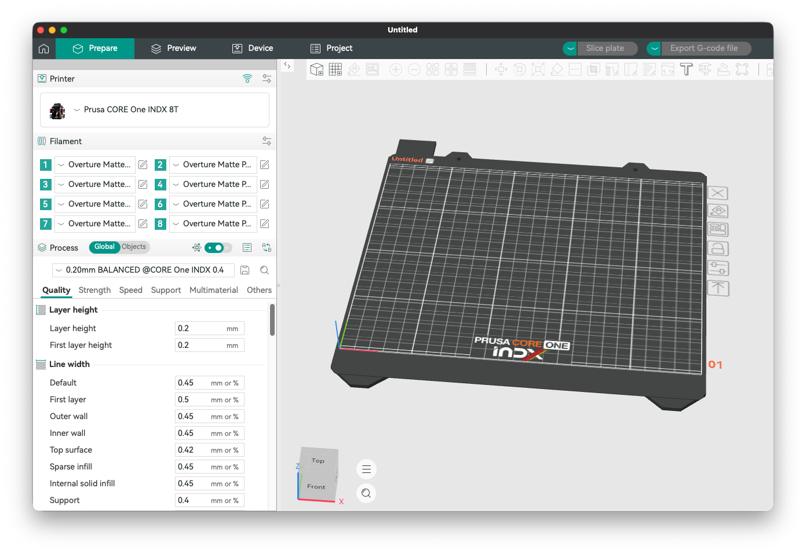

# Orca-INDX



Tooling and docs for porting the Prusa CORE One INDX 8T presets (machine,
process, filament) into OrcaSlicer's Prusa vendor bundle.

## Quick Start

To just use the profiles (no toolchain needed):

1. Download the profile files from the [latest release](../../releases/latest).
2. Quit OrcaSlicer (2.4.2 or newer).
3. Copy the release's `Prusa-INDX.json` and `Prusa-INDX/` folder into
   OrcaSlicer's system profile folder:
   - macOS: `~/Library/Application Support/OrcaSlicer/system/`
   - Windows: `%APPDATA%\OrcaSlicer\system\`
   - Linux: `~/.config/OrcaSlicer/system/`
4. Restart OrcaSlicer and add **Prusa CORE One INDX 8T** in Printer Selection.
   The 12 `@CORE One INDX` filaments and 4 processes come with it.

`Prusa-INDX` is its own vendor bundle: it never touches the stock Prusa
profiles, survives OrcaSlicer configuration updates, and uninstalls by
deleting the two copied paths. (If you previously merged these presets into
the stock `Prusa/` folder, undo that first to avoid duplicate presets.)

The source of truth is `PrusaSlicer-Source-Configs/PrusaSlicer_2.5.5.ini` —
the PrusaSlicer **Prusa-FFF 2.5.5** vendor configuration bundle, which
contains the official `COREONE_INDX8T` presets. The ported Orca profiles live
in the `OrcaSlicer/` clone (git-ignored here) on branch
`prusa-coreone-indx-8t` under `resources/profiles/Prusa/`, and are exported
to `output/<source-bundle>/` (e.g. `output/prusa-fff-2.5.5/`) for review
here.

## Layout

- `PrusaSlicer-Source-Configs/` — Prusa-FFF vendor bundle(s) the port is derived from
- `output/<source-bundle>/` — the standalone `Prusa-INDX` vendor bundle built from that source
- `tools/prusa_ini.py` — parses the bundle, resolves preset inheritance
- `tools/orca_json.py` — resolves OrcaSlicer profile inheritance chains
- `tools/keymap.py` — PrusaSlicer→Orca key maps, drop allowlist, value transforms
- `tools/check_fidelity.py` — diffs resolved PS presets against the ported Orca presets
- `tools/export.py` — copies the branch's added/changed profiles into `output/`
- `tools/deploy.sh` — syncs the ported profiles into the installed OrcaSlicer.app
- `tools/paths.py` — shared locations (source bundle, clone, output)
- `docs/superpowers/specs/` — design spec
- `plans/` — implementation plan

## Usage

```bash
# unit tests
python3 -m unittest discover -s tools/tests -t .

# fidelity gates (exit 0 = every mapped value matches PrusaSlicer)
python3 -m tools.check_fidelity machine
python3 -m tools.check_fidelity process
python3 -m tools.check_fidelity filament

# print the resolved PrusaSlicer values used for authoring
python3 -m tools.check_fidelity filament --expected

# build the standalone Prusa-INDX vendor bundle in output/<source-bundle>/
python3 -m tools.export

# deploy to /Applications/OrcaSlicer.app (quit Orca first)
tools/deploy.sh
```

Intentional deviations from the PrusaSlicer values (keys Orca lacks, renamed
semantics, g-code substitutions) are documented in `ALLOWLIST` and
`VALUE_TRANSFORMS` in `tools/keymap.py`.

## Updating from a newer Prusa bundle

Export the current bundle from PrusaSlicer (or fetch the Prusa-FFF vendor
ini) into `PrusaSlicer-Source-Configs/`, point `SRC_INI` in `tools/paths.py`
at it, re-run the fidelity gates, update the Orca profiles until they pass
again, and re-run `python3 -m tools.export`.
